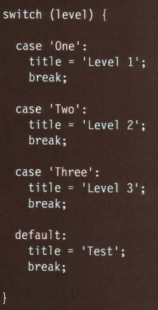

## HTML
### Text 
* HTML elements are used to describe the structure of
the page (e.g. headings, subheadings, paragraphs).
* They also provide semantic information (e.g. where
emphasis should be placed, the definition of any
acronyms used, when given text is a quotation)

## CSS
### Introducing CSS
* CSS treats each HTML element as if it appears inside
its own box and uses rules to indicate how that
element should look.
* Rules are made up of selectors (that specify the
elements the rule applies to) and declarations (that
indicate what these elements should look like).
* Different types of selectors allow you to target your
rules at different elements.
* Declarations are made up of two parts: the properties
of the element that you want to change, and the values
of those properties. For example, the font-family
property sets the choice of font, and the value arial
specifies Arial as the preferred typeface.
* CSS rules usually appear in a separate document,
although they may appear within an HTML page.

## Java Script
### Basic instructions
* A script is made up of a series of statements. Each
statement is like a step in a recipe.
* Scripts contain very precise instructions. For example,
you might specify that a value must be remembered
before creating a calculation using that value.
* Variables are used to temporarily store pieces of
information used in the script.
* Arrays are special types of variables that store more
than one piece of related information.
* JavaScript distinguishes between numbers (0-9),
strings (text), and Boolean values (true or false).
* Expressions evaluate into a single value.
* Expressions rely on operators to calculate a value. 

### Switch statements 
* You have a default option that is run if
none of the cases match.
* If a match is found, that code is run; then
the break statement stops the rest of
the switch statement running (providing
better performance than multiple if
statements). 
* *Example*
* 